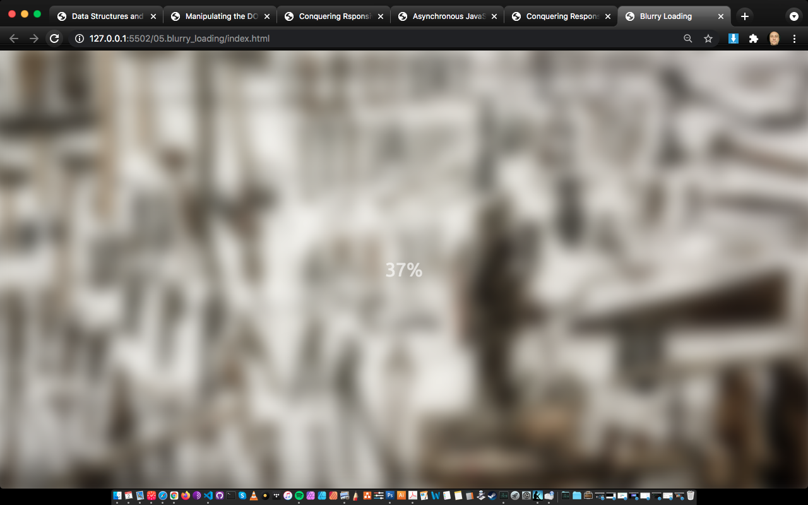

# 50projects

## Implementing HTML, CSS &amp; JS on a Udemy course made by Brad Traversy.

i can warmly advise to go for it, if you are learning basics or refreshing HTML, CSS and JS knowledge.
In between i make an overview to show the results.

### Expanding Cards
,

### Progress Steps

### 
, 
, 
