# 50projects

## Implementation of HTML, CSS and JS code

50 examples of pages including interactive:

- slideshows
- navigations (top, mobile)
- animations
- notifications
- generators (random numbers, passwords)
- API's (axios, async/await)
- button and click effects
- counters, loadings
- notes, drawing pad
- verifyier, feedback

Basics and intermediate knowledge. In this overview you can see the results.

Click on the animation and follow directly to the site:

|                                                                                                                           |                                                                                                                                       |                                                                                                                                     |
| :-----------------------------------------------------------------------------------------------------------------------: | :-----------------------------------------------------------------------------------------------------------------------------------: | :---------------------------------------------------------------------------------------------------------------------------------: |
|                                                      Expanding Cards                                                      |                                                            Progress Steps                                                             |                                                         Rotating Navigation                                                         |
|    [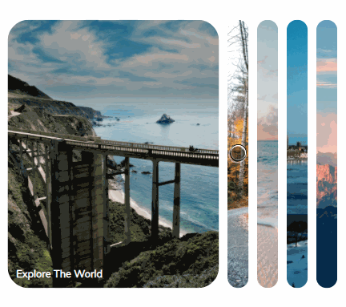](https://krisbaranski.github.io/50projects/course/01.expanding_cards/index.html)    |           [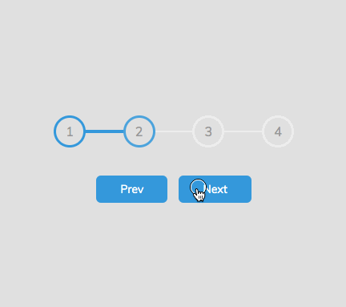](https://krisbaranski.github.io/50projects/course/02.progress_steps/index.html)           |     [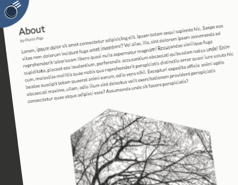](https://krisbaranski.github.io/50projects/course/03.rotating_navigation/index.html)     |
|                                                       Hidden Search                                                       |                                                            Blurry Loading                                                             |                                                          Scroll Animation                                                           |
|      [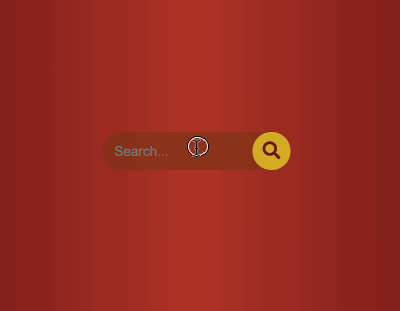](https://krisbaranski.github.io/50projects/course/04.hidden_search/index.html)      |                      |        [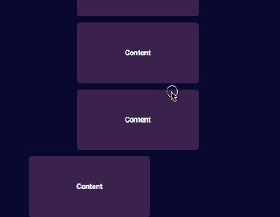](https://krisbaranski.github.io/50projects/course/06.scroll_animation/index.html)        |
|                                                       Split Landing                                                       |                                                         Login Wave Animation                                                          |                                                             Sound Board                                                             |
|      [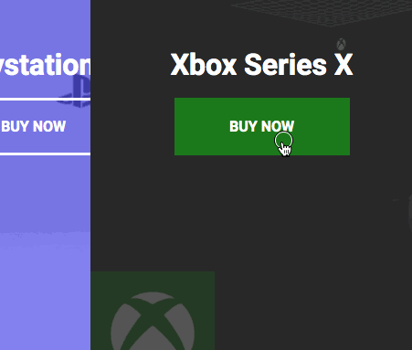](https://krisbaranski.github.io/50projects/course/07.split_landing/index.html)      |     [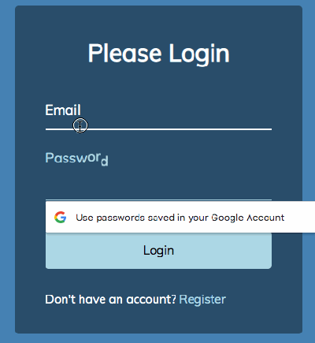](https://krisbaranski.github.io/50projects/course/08.login_wave_animation/index.html)     |             [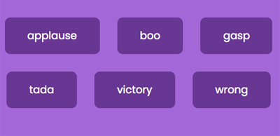](https://krisbaranski.github.io/50projects/course/09.sound_board/index.html)             |
|                                                         Dad Jokes                                                         |                                                            Event Keycodes                                                             |                                                            FAQ Collapse                                                             |
|          [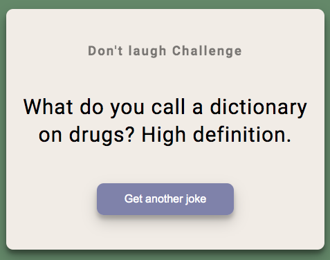](https://krisbaranski.github.io/50projects/course/10.dad_jokes/index.html)          |        [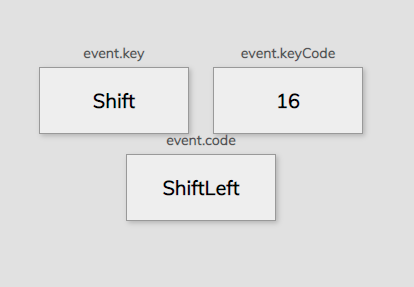](https://krisbaranski.github.io/50projects/course/11.event_keycodes/index.html)        |            [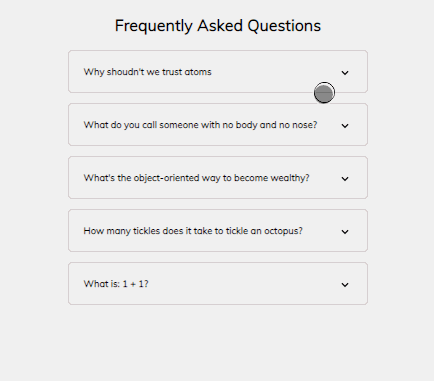](https://krisbaranski.github.io/50projects/course/12.faq_collapse/index.html)             |
|                                                       Random Choice                                                       |                                                          Animated Navigation                                                          |                                                         Increment Counters                                                          |
|            |      [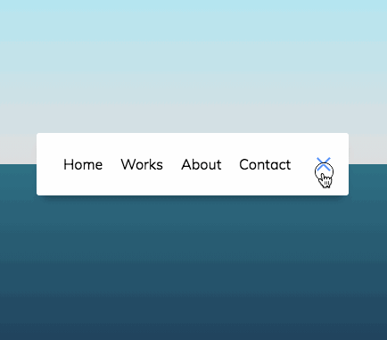](https://krisbaranski.github.io/50projects/course/14.animated_navigation/index.html)      |      [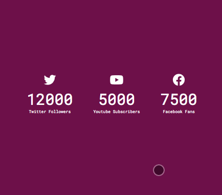](https://krisbaranski.github.io/50projects/course/15.increment_counters/index.html)       |
|                                                        Drink Water                                                        |                                                               Movie App                                                               |                                                          Background Slider                                                          |
|        [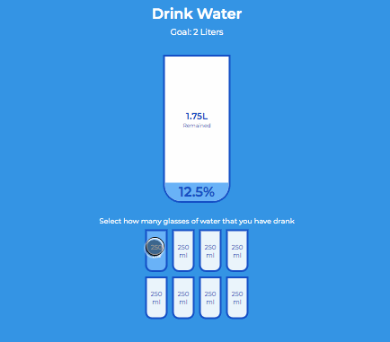](https://krisbaranski.github.io/50projects/course/16.drink_water/index.html)        |                [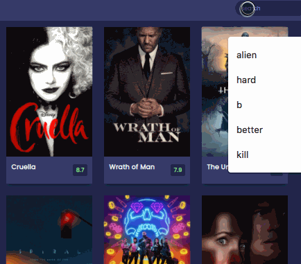](https://krisbaranski.github.io/50projects/course/17.movie_app/index.html)                |       [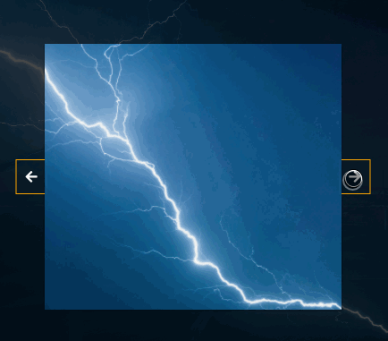](https://krisbaranski.github.io/50projects/course/18.background_slider/index.html)       |
|                                                        Theme Clock                                                        |                                                         Button Ripple Effect                                                          |                                                             Drag'N'Drop                                                             |
|        [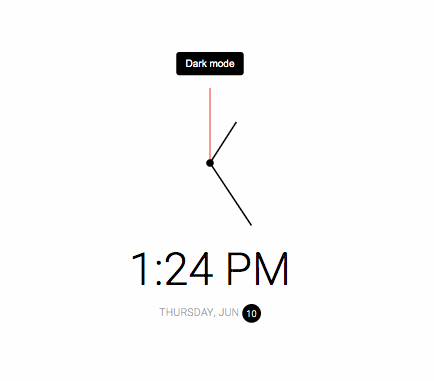](https://krisbaranski.github.io/50projects/course/19.theme_clock/index.html)        |          |             [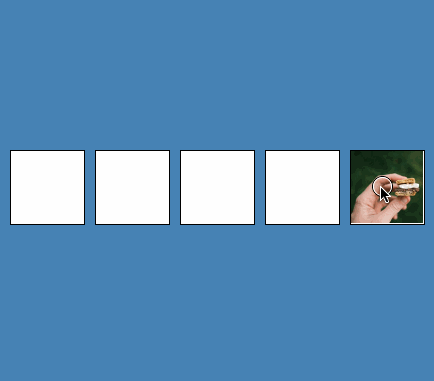](https://krisbaranski.github.io/50projects/course/21.drag_n_drop/index.html)             |
|                                                        Drawing Pad                                                        |                                                             Kinetic Load                                                              |                                                         Content Placeholder                                                         |
|                |             [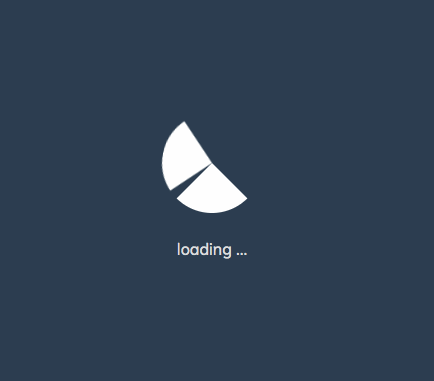](https://krisbaranski.github.io/50projects/course/23.kinetic_load/index.html)             |     [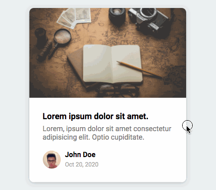](https://krisbaranski.github.io/50projects/course/24.content_placeholder/index.html)     |
|                                                       Sticky Navbar                                                       |                                                            Vertical Slider                                                            |                                                         Toast Notification                                                          |
|      [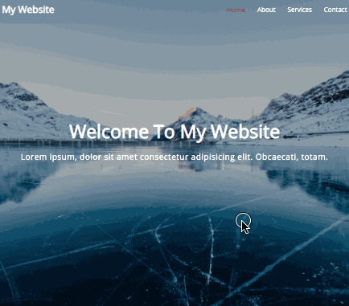](https://krisbaranski.github.io/50projects/course/25.sticky_navbar/index.html)      |          [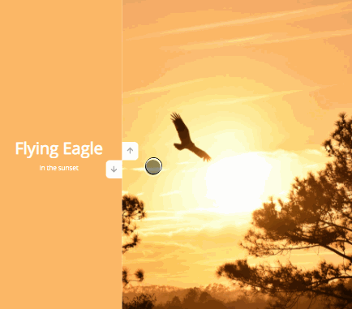](https://krisbaranski.github.io/50projects/course/26.vertical_slider/index.html)          |      [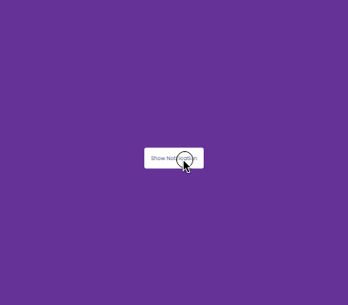](https://krisbaranski.github.io/50projects/course/27.toast_notification/index.html)      |
|                                                      Github Profiles                                                      |                                                          Double Heart Click                                                           |                                                          Auto text Effect                                                           |
|    [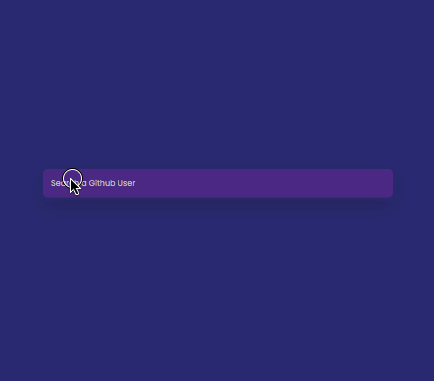](https://krisbaranski.github.io/50projects/course/28.github_profiles/index.html)    |       [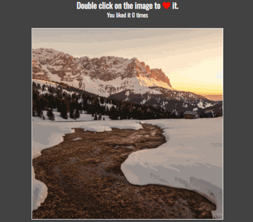](https://krisbaranski.github.io/50projects/course/29.double_heart_click/index.html)       |        [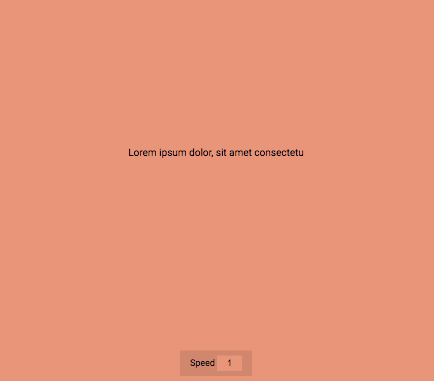](https://krisbaranski.github.io/50projects/course/30.auto_text_effect/index.html)        |
|                                                    Password Generator                                                     |                                                           Good, Cheap, Fast                                                           |                                                              Notes App                                                              |
| [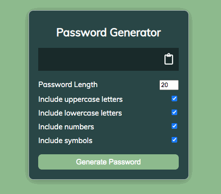](https://krisbaranski.github.io/50projects/course/31.password_generator/index.html) |         [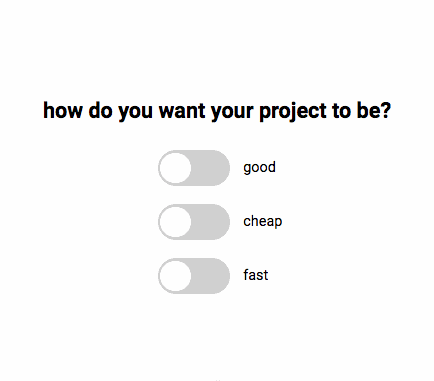](https://krisbaranski.github.io/50projects/course/32.style_checkboxes/index.html)         |               [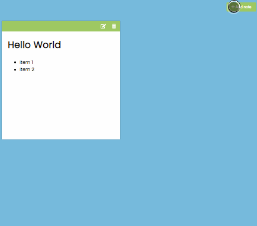](https://krisbaranski.github.io/50projects/course/33.notes_app/index.html)               |
|                                                    Animated Countdown                                                     |                                                            Image Carousel                                                             |                                                             Hoverboard                                                              |
| [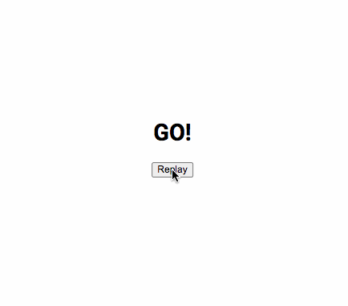](https://krisbaranski.github.io/50projects/course/34.animated_countdown/index.html) |           [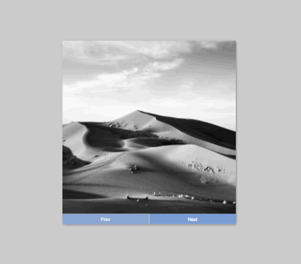](https://krisbaranski.github.io/50projects/course/35.image_carousel/index.html)           |              [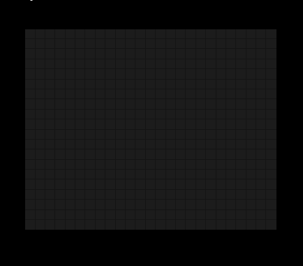](https://krisbaranski.github.io/50projects/course/36.hoverboard/index.html)              |
|                                                          Pokedex                                                          |                                                         Mobile Tab Navigation                                                         |                                                       Image Password Strength                                                       |
|            [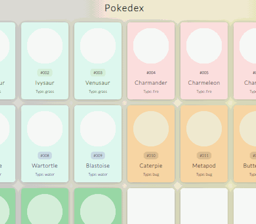](https://krisbaranski.github.io/50projects/course/37.pokedex/index.html)            |           [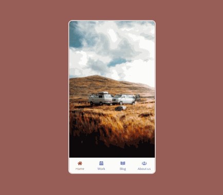](https://krisbaranski.github.io/50projects/course/38.mobile_tab_nav/index.html)           | [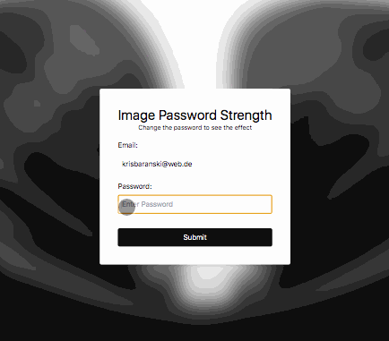](https://krisbaranski.github.io/50projects/course/39.image_password_strength/index.html) |
|                                                    3D Background Boxes                                                    |                                                           Verify Account UI                                                           |                                                          Live User Filter                                                           |
|     [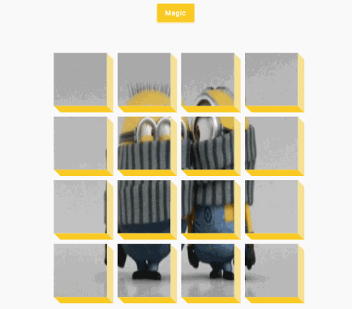](https://krisbaranski.github.io/50projects/course/40.3d_boxes/index.html)      |        [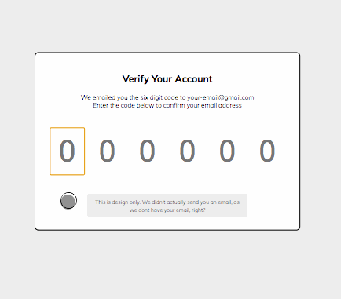](https://krisbaranski.github.io/50projects/course/41.verify_account_ui/index.html)        |        [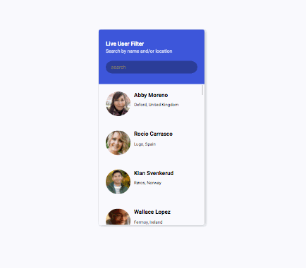](https://krisbaranski.github.io/50projects/course/42.live_user_filter/index.html)        |
|                                                        Feedback UI                                                        |                                                          Custom Range Slider                                                          |                                                         Netflix Navigation                                                          |
|        [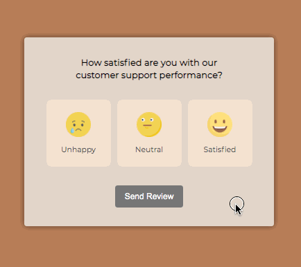](https://krisbaranski.github.io/50projects/course/43.feedback_ui/index.html)        |      [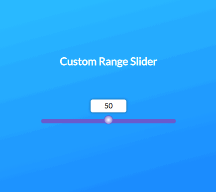](https://krisbaranski.github.io/50projects/course/44.custom_range_slider/index.html)      |      [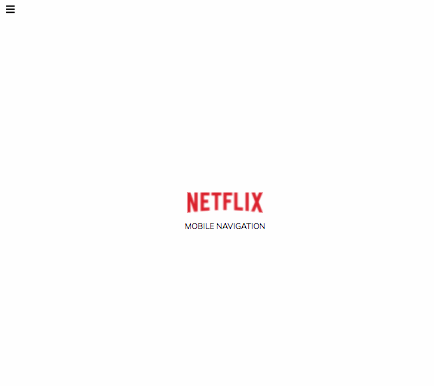](https://krisbaranski.github.io/50projects/course/45.netflix_navigation/index.html)      |
|                                                         Quiz App                                                          |                                                            Testimonial Box                                                            |                                                          Random Image Feed                                                          |
|                      | [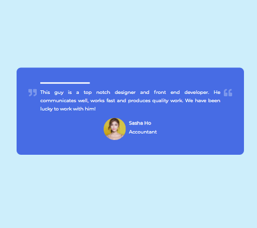](https://krisbaranski.github.io/50projects/course/47.testimonial_box_switcher/index.html) |       [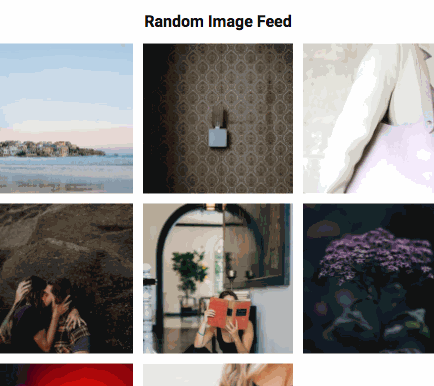](https://krisbaranski.github.io/50projects/course/48.random_image_feed/index.html)       |
|                                                         Todo List                                                         |                                                            Impossible Game                                                            |
|          [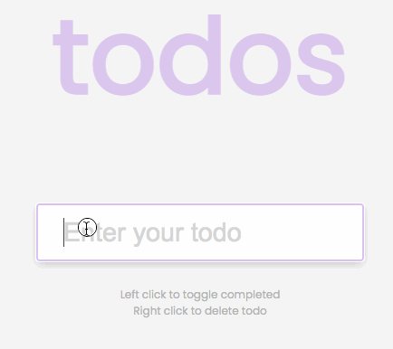](https://krisbaranski.github.io/50projects/course/49.todo_list/index.html)          |          [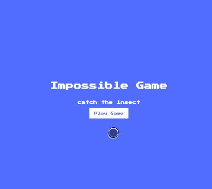](https://krisbaranski.github.io/50projects/course/50.impossible_game/index.html)          |                                                  thats it, i hope you enjoyed :-)                                                   |
