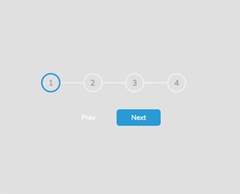

# 50projects

## Implementing HTML, CSS &amp; JS on a Udemy course made by Brad Traversy.

I warmly advise to go for this course, if you are learning basics or refreshing HTML, CSS and JS knowledge.
This is an overview to show the results:

| ### Expanding Cards | ### Progress Steps|
| --- | --- |
|  | |

| Syntax | Description |
| ----------- | ----------- |
| Header | Title |
| Paragraph | Text |

### Rotating Navigation

### Hidden Search

### Blurry Loading

###

