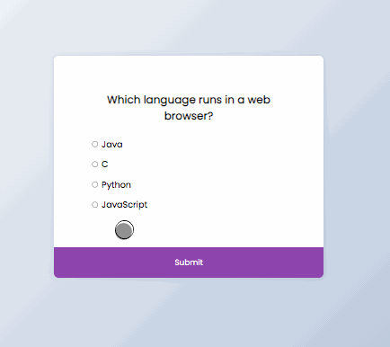

# 50projects

## Implementation of HTML, CSS and JS code

50 examples of pages including interactive:

- slideshows
- navigations (top, mobile)
- animations
- notifications
- generators (random numbers, passwords)
- API's (axios, async/await)
- button and click effects
- counters, loadings
- notes, drawing pad
- verifyier, feedback

Basics and intermediate knowledge. In this overview you can see the results.

Click on the animation and follow directly to the site:

|                                                                                                                           |                                                                                                                                       |                                                                                                                                     |
| :-----------------------------------------------------------------------------------------------------------------------: | :-----------------------------------------------------------------------------------------------------------------------------------: | :---------------------------------------------------------------------------------------------------------------------------------: |
|                                                      Expanding Cards                                                      |                                                            Progress Steps                                                             |                                                         Rotating Navigation                                                         |
|        |                      |          |
|                                                       Hidden Search                                                       |                                                            Blurry Loading                                                             |                                                          Scroll Animation                                                           |
|            |                      |                |
|                                                       Split Landing                                                       |                                                         Login Wave Animation                                                          |                                                             Sound Board                                                             |
|            |          |                          |
|                                                         Dad Jokes                                                         |                                                            Event Keycodes                                                             |                                                            FAQ Collapse                                                             |
|                    |                |                         |
|                                                       Random Choice                                                       |                                                          Animated Navigation                                                          |                                                         Increment Counters                                                          |
|            |            |             |
|                                                        Drink Water                                                        |                                                               Movie App                                                               |                                                          Background Slider                                                          |
|                |                                |              |
|                                                        Theme Clock                                                        |                                                         Button Ripple Effect                                                          |                                                             Drag'N'Drop                                                             |
|                |          |                          |
|                                                        Drawing Pad                                                        |                                                             Kinetic Load                                                              |                                                         Content Placeholder                                                         |
|                |                          |          |
|                                                       Sticky Navbar                                                       |                                                            Vertical Slider                                                            |                                                         Toast Notification                                                          |
|            |                    |            |
|                                                      Github Profiles                                                      |                                                          Double Heart Click                                                           |                                                          Auto text Effect                                                           |
|        |              |                |
|                                                    Password Generator                                                     |                                                           Good, Cheap, Fast                                                           |                                                              Notes App                                                              |
|  |                  |                              |
|                                                    Animated Countdown                                                     |                                                            Image Carousel                                                             |                                                             Hoverboard                                                              |
|  |                      |                            |
|                                                          Pokedex                                                          |                                                         Mobile Tab Navigation                                                         |                                                       Image Password Strength                                                       |
|                        |                      |  |
|                                                    3D Background Boxes                                                    |                                                           Verify Account UI                                                           |                                                          Live User Filter                                                           |
|           |                |                |
|                                                        Feedback UI                                                        |                                                          Custom Range Slider                                                          |                                                         Netflix Navigation                                                          |
|                |            |            |
|                                                         Quiz App                                                          |                                                            Testimonial Box                                                            |                                                          Random Image Feed                                                          |
|                      |  |              |
|                                                         Todo List                                                         |                                                            Impossible Game                                                            |
|                    |                    |                                                  thats it, i hope you enjoyed :-)                                                   |
